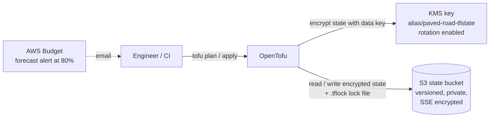

# paved-road-aws

A self-service application platform on AWS, built with **OpenTofu**.

The goal is a "paved road": a developer describes a service in a small config file, opens a pull request, and gets a production-ready environment (network, container service, database, secrets and monitoring) through a reviewed, automated pipeline, without needing to be an AWS expert.

This repository is a hands-on platform engineering project. It is built in phases, and each phase is documented with the decisions behind it.

---

## Status


| Phase                      | Scope                                                                                | Status     |
| -------------------------- | ------------------------------------------------------------------------------------ | ---------- |
| 1. Foundations             | Remote state, locking, state encryption, cost guardrails                             | ✅ Complete |
| 2. Network                 | Reusable VPC module, dev environment                                                 | 🔜 Next    |
| 3. Service module          | ECS Fargate, ALB, RDS Postgres, Secrets Manager, CloudWatch                          | Planned    |
| 4. Pipeline and guardrails | GitHub Actions with OIDC, plan on PR, policy checks, cost estimates, drift detection | Planned    |


---

## Phase 1: Foundations

The bootstrap stack creates everything the rest of the platform needs before any application infrastructure exists.



**What it provides**

- **Remote state in S3.** Versioning is enabled so any previous state can be recovered, all public access is blocked, and objects are encrypted at rest.
- **Native S3 state locking** (`use_lockfile`, OpenTofu 1.10+). Concurrent runs cannot corrupt state, and no DynamoDB table is needed.
- **Client-side state encryption** using OpenTofu's `encryption` block with an AWS KMS key provider and AES-GCM. State is encrypted before it leaves the machine, so reading it requires both bucket access *and* permission to use the KMS key. Encryption is `enforced`, so plain-text state can never be written.
- **Self-managed bootstrap.** The bootstrap stack stores its own state in the bucket it created.
- **Protection against accidents.** The state bucket and KMS key both use `prevent_destroy`; losing either would mean losing the platform's state.
- **Cost guardrail.** An AWS Budget emails a warning when forecast spend passes 80% of the monthly limit.
- **Default tags** on every resource (`Project`, `ManagedBy`, `Stack`) for cost reporting and ownership.

---

## Repository structure

```
bootstrap/          State bucket, KMS key, budget (phase 1)
modules/            Reusable platform modules (vpc, app-service, observability)
envs/
  dev/              Development environment
  prod/             Production environment
docs/
  adr/              Architecture Decision Records
.github/workflows/  CI/CD pipelines (phase 4)

```

---

## Security principles

- **No root for daily work.** An IAM admin user with MFA is used for all work; the root user is locked away with MFA.
- **No long-lived credentials in CI.** The pipeline (phase 4) will authenticate to AWS with GitHub OIDC and short-lived role credentials.
- **Nothing sensitive in Git.** State files and `.tfvars` are gitignored; provider versions are pinned via the committed `.terraform.lock.hcl`.
- **Defence in depth for state.** S3 server-side encryption plus OpenTofu client-side encryption with KMS.

---

## Getting started

### Prerequisites

- [OpenTofu](https://opentofu.org/) 1.10 or newer
- AWS CLI v2, authenticated to your own AWS account (not the root user)
- Region: `eu-west-2` (London) by default

### Bootstrapping a new account

The bootstrap stack has a chicken-and-egg problem: it creates the bucket and KMS key that its own state will live in. It is therefore applied in stages.

1. **Update names for your account.** The bucket name includes the account ID, so change `bucket` in `bootstrap/[backend.tf](http://backend.tf)` to `paved-road-tfstate-<your-account-id>`.
2. **Create** `bootstrap/terraform.tfvars` (gitignored):
  ```hcl
  budget_email = "you@example.com"
  
  ```
3. **First apply with local state.** Temporarily comment out the `backend` and `encryption` blocks in [`backend.tf`](http://backend.tf), then:
  ```bash
  cd bootstrap
  tofu init
  tofu plan
  tofu apply
  
  ```
4. **Move state into S3.** Uncomment the `backend` block and migrate:
  ```bash
  tofu init -migrate-state
  tofu plan   # should report: No changes
  
  ```
5. **Enable state encryption.** Uncomment the `encryption` block with a temporary `unencrypted` fallback method, apply once so state is rewritten encrypted, then remove the fallback and set `enforced = true`:
  ```bash
  tofu apply
  tofu plan   # should report: No changes
  
  ```
6. **Clean up** local state leftovers: `rm -f terraform.tfstate terraform.tfstate.backup`.

To confirm the state is encrypted, the object in S3 should contain an `encrypted_data` field rather than readable resource attributes:

```bash
aws s3 cp s3://paved-road-tfstate-<account-id>/bootstrap/terraform.tfstate - | head -c 400

```

---

## Cost

Phase 1 costs roughly **$1 per month** (the KMS key), plus negligible S3 storage and requests. Later phases introduce running infrastructure; dev environments are designed to be destroyed when not in use, and a budget alert is in place from day one.

---

## Architecture decisions

Key decisions are recorded as ADRs in [`docs/adr/`](https://claude.ai/chat/docs/adr/):

- `0001` State management: S3, native locking and KMS-backed OpenTofu state encryption
- `0002` Network design for dev: NAT gateway vs lower-cost alternatives *(phase 2)*

---

